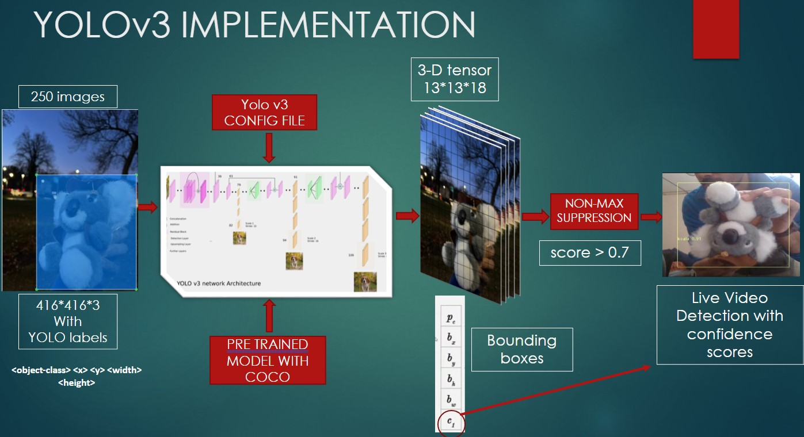
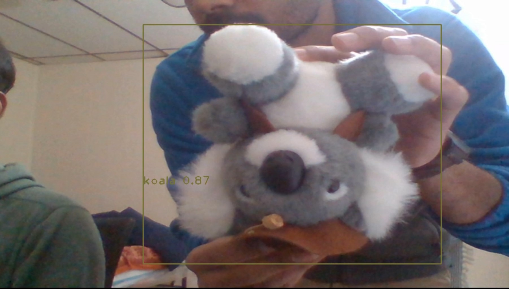
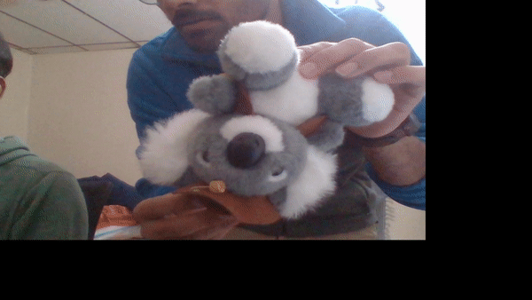

# Koala_Realtime_Detection_YOLO

#### How to Run
1. Create Dataset folder and include following items in the folder
    a) test.txt - Contains list of all test images
    b) train.txt - contains all training images
    c) All training and testing images in .jpg format with labels from labellmg tool
    d) classes.names - contains all class names
    e) data_locations.data - contains all location information regarding data and backup

2. Download Pretrained weights on COCO dataset from https://pjreddie.com/media/files/darknet53.conv.74
3. Modify yolov3.cfg file according to the number of classes
4. Training the Model: train.ipynb
5. Testing the Model: 
'''
python3 koala_Real_time_detection.py
'''

#### Methodology:

#### Results:

